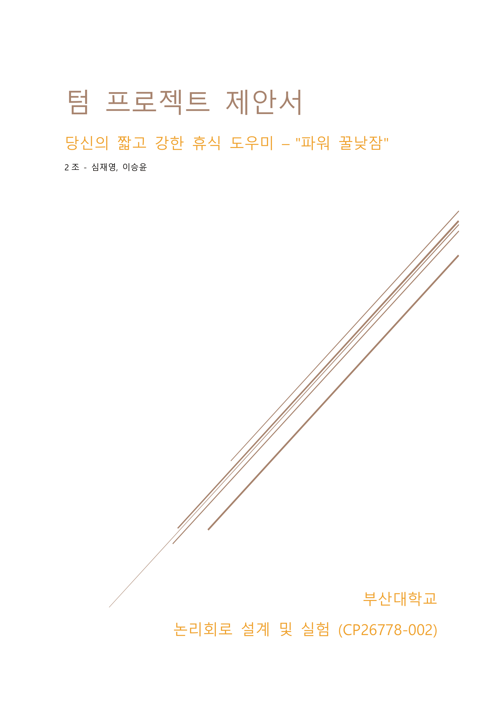
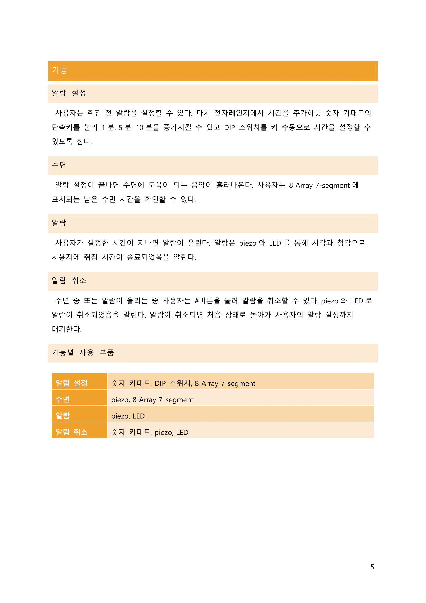

# Power Honey Nap - 파워꿀낮잠

# 제안서
프로젝트 목표
=============

1.  다양한 논리 회로를 설계하고 그 동작을 이해할 수 있다.

2.  디지털 논리 회로를 구현하여 FPGA 보드로 표현할 수 있다.

3.  설계 효율 및 설계 접근 방법에 대한 고려를 할 수 있다.

1학기 논리 회로 설계 수업과 2학기 논리 회로 설계 및 실험 실습을 바탕으로 디지털
논리 회로를 구현하고 FPGA 보드에서 작동할 수 있도록 구현한다. 논리 회로를
설계함에 있어 효율 및 접근 방법을 고려하여 설계할 수 있는 능력을 키운다.

주제
====

수면 부족 문제
------------------------------------------

BBC가 50만명을 대상으로 진행한 153개 논문을 분석한 결과 수면 부족은 인지 기능
저하, 면역력 저하, 예방 접종 효과 저하, 심혈관 질환, 관상 동맥성 심장 질환,
고혈압, 당뇨와 크게 연관된 것으로 드러났다. 일주일에 3번 이상 충분한 수면을
취하지 못한 인구는 약 20% 정도로 5명 중 1명은 일주일에 3번 이상 충분한 수면을
취하지 못하는 것으로 드러났다.

낮잠
----

낮잠을 통해 부족한 수면 시간을 보충하고 불면증 및 수면장애를 치료하여 충분한
수면을 취할 수 있도록 할 수 있다. 수면에서 중요한 것은 수면의 질, 시간 분배,
신체가 필요로 할 때 자는 것이다. 점심을 먹고 나면 잠이 오는데 이는 무엇인가를
먹어서라기보다는 신체의 경고 신호이며 신체가 잠을 요구하기 때문에 발생하는
것이다. 이때 20분 정도 수면을 취하면 몸이 재충전된다.

낮잠을 자고 나면 피로가 회복되고 두뇌 회전이 빨라진다. 이는 밤에 잠을 잘 때처럼
낮에 잠을 자도 뇌파의 주기가 느려지고 스트레스 호르몬인 코르티솔 분비가
줄어든다. 낮잠은 심장 질환 및 고혈압에도 도움을 준다. 연구 결과에 따르면 하루
20분의 낮잠이 평균 5mmHg의 혈압을 낮추는데 이는 혈압약의 효능과 일치한다. 낮잠은
기억력 향상에도 도움을 주는데 30분 이하의 낮잠을 습관적으로 자는 사람은 낮잠을
자지 않는 사람보다 알츠하이머 발병 비율이 현저히 낮으며 45분간의 낮잠으로
기억력을 최대 5배까지 높일 수 있는 것으로 드러났다.

파워 꿀낮잠
-----------

수면에서 중요한 필요로 할 때 자는 것, 수면의 질, 시간 분배를 지키기 위해 짧고
강한 휴식 도우미 "파워 꿀낮잠"을 제안한다. 사용자는 수면이 필요할 때 파워
꿀낮잠(이하 장치)을 사용할 수 있다. 적절한 수면 시간 분배를 위해 사용자는 수면
전 낮잠 시간을 설정하고 시간이 지나면 장치는 알람을 통해 사용자를 깨운다. 수면의
질을 높이기 위해 사용자가 자는 동안 장치는 수면에 도움이 되는 음악을 사용자에
들려준다. 이를 통해 장치는 사용자가 편안하고 깊게 수면을 취할 수 있도록 한다.

기능
====

알람 설정
---------

사용자는 취침 전 알람을 설정할 수 있다. 마치 전자레인지에서 시간을 추가하듯 숫자
키패드의 단축키를 눌러 1분, 5분, 10분을 증가시킬 수 있고 DIP 스위치를 켜
수동으로 시간을 설정할 수 있도록 한다.

수면
----

알람 설정이 끝나면 수면에 도움이 되는 음악이 흘러나온다. 사용자는 8 Array
7-segment에 표시되는 남은 수면 시간을 확인할 수 있다.

알람
----

사용자가 설정한 시간이 지나면 알람이 울린다. 알람은 piezo와 LED를 통해 시각과
청각으로 사용자에 취침 시간이 종료되었음을 알린다.

알람 취소
---------

수면 중 또는 알람이 울리는 중 사용자는 \#버튼을 눌러 알람을 취소할 수 있다.
piezo와 LED로 알람이 취소되었음을 알린다. 알람이 취소되면 처음 상태로 돌아가
사용자의 알람 설정까지 대기한다.

기능별 사용 부품
----------------

| 알람 설정 | 숫자 키패드, DIP 스위치, 8 Array 7-segment |
|-----------|--------------------------------------------|
| 수면      | piezo, 8 Array 7-segment                   |
| 알람      | piezo, LED                                 |
| 알람 취소 | 숫자 키패드, piezo, LED                    |

구현 내용 및 방법
=================

알람 설정
---------

### 시간 표시

7-Segment Array는 다수의 7 Segment를 사용한 표시장치이다. 8개의 각 자리에 서로
다른 데이터(시간 분 초)를 출력한다. 우리는 시간, 분, 초 만 출력함으로 뒤에 6개의
7Segment만 사용하려 한다. 시간, 분, 초는 각각 2자리를 사용하며 (COM3-4 : 시간 /
COM5-6 : 분 / COM7-8 : 초) 각 단위는 점으로 구분한다.

각 자리에 서로 다른 데이터를 출력하기 위해서는 아래의 방법과 같이 출력하고자
하는 자리의 com\# 값에 ‘0’을 넣어주고 출력할 숫자에 맞는 Seg_(a\~g) 값을 설정해
원하는 값을 출력한다.

시간 표시는 수면 시간을 설정할 때와 수면 중 남은 시간을 표시할 때 모두 사용되는
기본적인 기능이다. 사용자의 구분을 위해 시간 설정 시에는 7세그먼트가 일정 시간
간격으로 깜빡거리도록 한다.

### 수면 시간 설정

1.  DIP SWITCH 8 **ON** : 타이머 수동설정 모드

타이머 수동설정 모드로 키패드 버튼(0\~9)을 통해서 시간을 직접 설정한다. 시간,
분, 초간의 단위 변경은 \#버튼을 눌러 수행한다. 시간 설정 중 해당 단위의
세그먼트만 깜빡이도록 하여 사용자가 어떤 단위를 설정하고 있는지 시각적으로
표시한다.

1.  DIP SWITCH 8 **OFF** : 타이머 단축키설정 모드

수동 설정으로 시간을 설정하지 않은 경우 시간, 분, 초는 모두 0으로 초기화되어
있고 키패드에서 1, 2, 3 버튼을 누르면 시간이 추가된다. 수동 설정으로 시간을
수정한 경우 사용자가 설정한 해당 시간에서 시간이 추가된다.

-   키패드 버튼 1 : +1분
-   키패드 버튼 2 : +5분
-   키패드 버튼 3 : +10분

### 저장

타이머 수동설정 모드의 경우 키패드 버튼을 통해 시간을 입력한다. ‘\#’버튼을
이용하여 단위를 선택하여 설정하고 싶은 숫자의 키패드 버튼을 누른다. 입력한 값이
분, 초의 첫째 자리이고 6이상인 경우를 제외하고는 그 값을 바로 레지스터에
저장한다. 단축키 설정 모드에서는 현재 레지스터에 저장된 값에서 각 단축키에
할당된 값을 더한 값을 레지스터에 다시 저장한다. 각 자리는 하나의 숫자이므로
4bit레지스터에 값을 저장하여 사용하며 분, 초가 60 이상이 되면 단위 올림을
수행하여 레지스터에 저장된 값을 조정한다.

수면
----

### 타이머

FPGA 보드에서 클럭은 기본적으로 제공하는 클럭을 사용한다. FPGA 보드에서의
기본적으로 제공하는 클럭의 주파수가 1Mhz이다. 수면시간을 설정한 사용자가 남은
수면시간을 정확하게 체크 하기 위해서는 1초마다 1씩 감소하도록 구현해야한다.
1초를 정확하게 카운트하기 위해서는 클럭의 기본 주파수 1Mhz를 계산하여 1초에
맞추어 감소하도록 카운터를 설계하여 8 Array 7 -Segment에 출력한다. 초, 분,
시간은 60진법을 사용하고 낮은 단위가 모두 감소되면 높은 단위가 감소되는 형식으로
구현해야한다. 초가 모두 감소되면 분이 감소되고 분이 모두 감소되면 시간이
감소하도록 설계한다. 레지스터에 저장된 시간이 0이 되면 알람이 울리도록 한다.

### 수면 유도 음악

수면 단계에서는 piezo를 이용하여 수면에 도움이 되는 음악을 사용자에 들려준다.

알람
----

### 알람

사용자가 입력한 시간이 끝나면 알람이 울린다. 알람은 Piezo를 통해 출력된다. Full
color LED를 통해 시청각적 효과를 배가시킨다.

### 알람 취소

수면 단계 또는 알람이 울리는 중 사용자는 '\#' 버튼을 눌러 설정된 알람을 취소할
수 있다. 알람이 울릴 때와 수면 단계에서 있을 때 ‘\#’ 버튼을 눌러 알람이 취소되는
것은 같지만 2가지 상황에 대해 Full Color LED가 다른 색깔을 출력하고 Piezo에서
다른 알림 음이 나도록 구현한다.
음악, 알람, 알림 상세

수면 음악, 알람, 알람 취소 알림들의 음악들은 각 상황에 맞는 음악으로 미리
입력하여 각 기능이 동작해야 할 때 PIEZO를 통해 알맞은 사운드를 출력한다.

### PIEZO

소리를 출력하는 장치로 간단한 스피커의 역할을 한다.

1.  PIEZO는 소리의 높낮이는 조절하지 못하지만, 주파수를 조정하여 소리를
    발생시킨다.

2.  일반적으로 3 옥타브가 사람들이 사용하는 옥타브이다.

| 음계 | 옥타브에 따른 주파수          |                 |                 |
|------|-----------------|-----------------|-----------------|
|      | **2**           | **3**           | **4**           |
| 도   | **130.8128 Hz** | **261.6256 Hz** | **523.2511 Hz** |
| 레   | **146.8324 Hz** | **293.6648 Hz** | **587.3295 Hz** |
| 미   | **164.8138 Hz** | **329.6276 Hz** | **659.2551 Hz** |
| 파   | **174.6141 Hz** | **349.2282 Hz** | **698.4565 Hz** |
| 솔   | **195.9977 Hz** | **391.9954 Hz** | **783.9909 Hz** |
| 라   | **220.0000 Hz** | **440.0000 Hz** | **880.0000 Hz** |
| 시   | **246.9417 Hz** | **493.8833 Hz** |                 |

-   분주 사용 : PEIZO는 일반적으로 분주를 통해 clock 조절이 필요하다.

>   ( 분주 : 주파수를 1/n로 하는 일 (카운터 , D F/F 등으로 가능) )

>   **클럭 / 음계 주파수**

Ex) 3옥타브 “도” (1MHz의 클럭 사용시)

**1000000 / 261.6256 = 3822.25…** 따라서, Parameter로 분주값 3822를 지정한다.
### FULL COLOR LED

알람이 울릴 때와 수면 기능이 구현되고 있을 때 ‘\#’ 버튼을 눌러 알람 취소 기능
구현할 때 각각의 상황에 대해 Full Color LED를 통해서 원하는 색깔을 출력한다.

1.  Red 4bit, Green 4bit, Blue 4bit 로 구성

2.  각 핀에 신호를 보내 색을 결정

    -   **빨간색과 노란색 출력 예시**

|       | [3]   | [2]   | [1]   | [0]   |
|-------|-------|-------|-------|-------|
| Red   | **1** | **1** | **1** | **1** |
| Green | **0** | **0** | **0** | **0** |
| Blue  | **0** | **0** | **0** | **0** |

|       | [3]   | [2]   | [1]   | [0]   |
|-------|-------|-------|-------|-------|
| Red   | **1** | **1** | **1** | **1** |
| Green | **1** | **1** | **1** | **1** |
| Blue  | **0** | **0** | **0** | **0** |

사용 예정 모듈
--------------

1.  Encoder & Decoder : 인코더를 통해서 2진 코드로 변환해야 한다. 또한 2진
    코드로 받아 10진으로 변환해야 하는 경우 디코더를 사용한다.

2.  CLK_DIV : Clock을 조절함으로 옥타브를 선택하여 원하는 음악을 출력한다.

3.  Control Unit : 데이터 처리를 할 수 있도록 제어 신호를 공급, 데이터 흐름을
    조절하고 시스템의 정해진 작업을 수행한다.

4.  Level to Pulse : Clock 속도를 조절하여 적절한 입력 시 정확한 소리를 내는
    작업을 수행한다.
    
흐름도
------

###세로  
 

###가로  

역할 분담
=========

두 팀원 모두 처음부터 끝까지 진행되는 모든 기능 개발에 함께 참여할 것이지만,
아래 분담을 나눈 것은 조금 더 책임을 가지고 공부하여 기능 개발 구현을 하는데
있어서 효율적인 진행을 위해 나누었다.

|  이름   | 역할 |
|--------|--------------------------------------------------|
| 심재영  | 타이머 기능 구현                                 |
|        | 음악 제작, piezo 제어                            |
|        | 모듈 배치                                        |
| 이승윤  | 회로도 설계                                      |
|        | LED, 8 Array 7-segment, 스위치, 숫자 키패드 제어 |
|        | FPGA 보드 동작 확인                              |

개발 일정
=========

|                    | 11월 3주 | 11월 4주 | 12월 1주 | 12월 2주 | 12월 3주 |
|--------------------|----------|----------|----------|----------|----------|
| 제안서             |----------|          |          |          |          |
| 일반 모듈 설계     |----------|----------|          |          |          |
| 타이머             |          |----------|----------|          |          |
| 음악출력기능       |          |----------|----------|----------|          |
| LED, 세그먼트 제어 |          |          |----------|----------|          |
| 최종동작확인       |          |          |          |----------|----------|
| 결과보고서         |          |          |          |----------|----------|

참고 문헌
=========
| | |
|---|-----------------------------------------------------------------------------------------------------------------------------------------------------------------------------------------------------------------------------------------------------------------|
| [1] | BBC, “잠: 짧은 수면 시간은 건강에 해롭다,” BBC, 31 10 2017. [온라인]. Available: https://www.bbc.com/korean/features-41775870. [액세스: 18 11 2020].                                                                                                            |
| [2] | B. Comby, Eloge de la sieste, J'ai lu, 2016.                                                                                                                                                                                                                    |
| [3] | G. Meadows, “낮잠을 자야 하는 이유와 그 효과,” BBC, 13 3 2019. [온라인]. Available: https://www.bbc.com/korean/news-47537921. [액세스: 18 11 2020].                                                                                                             |
| [4] | 이금숙, “낮잠이 선사하는 건강효과, 기억력 높이고 업무 효율 높여,” 헬스조선, 17 3 2016. [온라인]. Available: http://m.health.chosun.com/svc/news_view.html?contid=2016031701219. [액세스: 18 11 2020].                                                           |
| [5] | 김병희, “잠이 보약인 과학적 이유,” 사이언스타임즈(한국과학창의재단), 14 2 2019. [온라인]. Available: https://www.sciencetimes.co.kr/news/%EC%9E%A0%EC%9D%B4-%EB%B3%B4%EC%95%BD% EC%9D%B8-%EA%B3%BC%ED%95%99%EC%A0%81-%EC%9D%B4%EC%9C%A0/. [액세스: 18 11 2020]. |

# 제안서 (그래픽)

